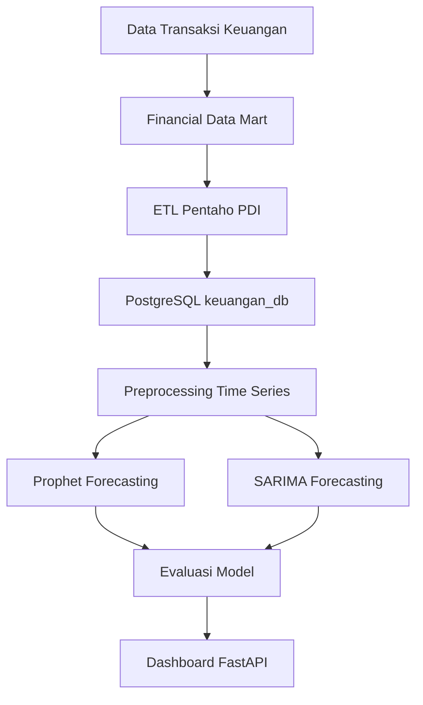

# Implementasi Financial Data Mart dan Forecasting Pendapatan Bulanan Menggunakan Prophet dan SARIMA pada Perusahaan Dagang

## Overview

Project ini merupakan implementasi sistem analitik keuangan end-to-end yang mengintegrasikan Financial Data Mart berbasis Star Schema, pipeline ETL menggunakan Pentaho PDI, forecasting pendapatan bulanan menggunakan Prophet dan SARIMA, serta dashboard web interaktif berbasis FastAPI dan PostgreSQL.

Hasil penelitian menunjukkan bahwa model Prophet memberikan performa terbaik dengan nilai MAPE sebesar 5.63%, sedikit lebih baik dibandingkan SARIMA sebesar 5.70%.

---

## Architecture / Pipeline



---

## Tech Stack

- Python 3.12
- FastAPI
- PostgreSQL 17
- Pentaho Data Integration (PDI)
- Prophet
- SARIMA (statsmodels)
- Pandas
- Scikit-learn
- Matplotlib
- HTML, CSS, JavaScript
- Chart.js

---

## Main Features

- Financial Data Mart berbasis Star Schema
- Pipeline ETL menggunakan Pentaho
- Forecasting pendapatan bulanan
- Perbandingan Prophet vs SARIMA
- Evaluasi forecasting:
  - MAE
  - RMSE
  - MAPE
  - ADF Test
  - KPSS Test
  - Ljung-Box Test
  - Residual ACF/PACF
- Dashboard web interaktif
- Monitoring data warehouse

---

## Forecasting Result

| Model | MAPE |
|---|---|
| Prophet | 5.63% |
| SARIMA | 5.70% |

Best Model: **Prophet**

---

## Project Structure

```bash
ForecastingGPR/
│
├── app/
│   ├── main.py
│   └── templates/
│       └── dashboard.html
│
├── src/
│   ├── config/
│   ├── preprocessing/
│   ├── models/
│   ├── evaluation/
│   └── visualization/
│
├── outputs/
├── requirements.txt
├── main.py
└── README.md
```

---

## Installation

### Clone Repository

```bash
git clone https://github.com/username/project-name.git
cd project-name
```

### Create Virtual Environment

```bash
python -m venv venv
source venv/bin/activate
```

Windows:

```bash
venv\Scripts\activate
```

### Install Dependencies

```bash
pip install -r requirements.txt
```

---

## Run Forecasting

```bash
python3 main.py
```

---

## Run FastAPI Dashboard

```bash
uvicorn app.main:app --reload --port 8081
```

Open browser:

```text
http://127.0.0.1:8081
```

---

## Evaluation Metrics

| Metric | Description |
|---|---|
| MAE | Mean Absolute Error |
| RMSE | Root Mean Squared Error |
| MAPE | Mean Absolute Percentage Error |
| ADF | Stationarity Test |
| KPSS | Trend Stationarity Test |
| Ljung-Box | Residual White Noise Test |

---

## Dashboard Features

- Revenue Monitoring
- Forecast Visualization
- Prophet vs SARIMA Comparison
- ETL Monitoring
- Data Warehouse Statistics
- Forecast Evaluation
- Residual Diagnostics

---

## Future Improvements

- Docker Deployment
- Real-time ETL
- LSTM Forecasting
- Authentication System
- Power BI Integration
- Anomaly Detection

---

## Author

Randi Nandika  
Politeknik Elektronika Negeri Surabaya (PENS)
